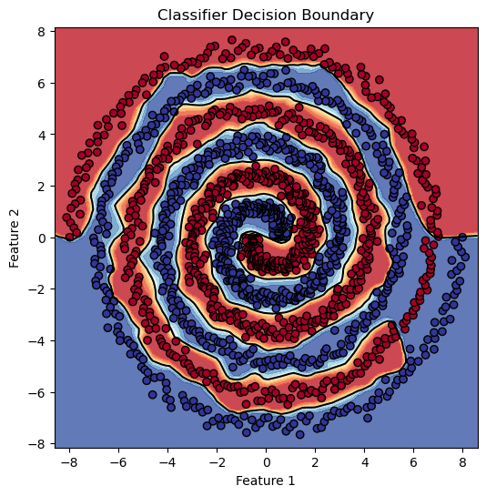

## Some Projects:
### Overtwisted Contact Structures and their Supporting Open Books on 3-Manifolds
**[Intersting Topology stuff that I have forgotten](4H_Project_FINAL.pdf)**

This is my Fourth year dissertation on the Giroux correspondance; a one-to-one correspondence between Contact structures and open book decompositions. There is something for all, topologists and geometrists alike!

### ON IDENTIFIABILITY IN TRANSFORMER NEURAL NETWORKS
**[Transformers, GPT and more Buzzwords](On_Identifiability_In_Transformers_Notes.pdf)**

This was a group project written in conjuction with Logan, Finlo and Arden (Fellow CAM students). Cool topic but was quite a short project. It felt a bit rushed. I would love to revisit transformers.

### A Deep Learning Architecture for Inferring Physical Activity and Sleep from Wrist-Worn Actigraphy Data (Coming Soon!)

This is my current project for the CAM MSc.

---
Word of Warning: Read the above one at a time. Some may suffer from symptoms of [Whiplash](https://www.nhs.uk/conditions/whiplash/) going between the Topology and Deep Learning.
### DARTH Group website:
**[DARTH Group](https://www.darth-group.com/team)**

<!--  -->
